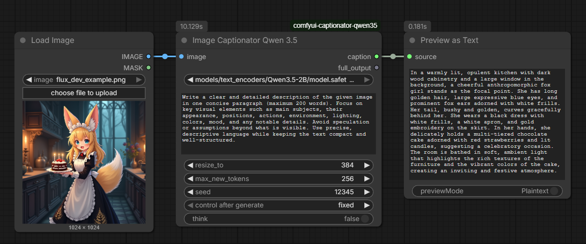
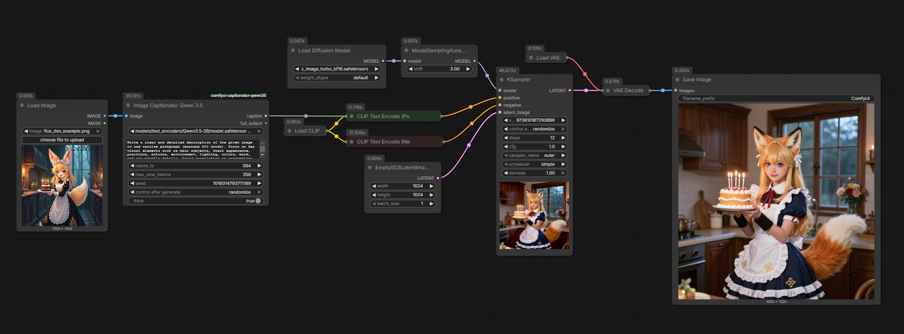
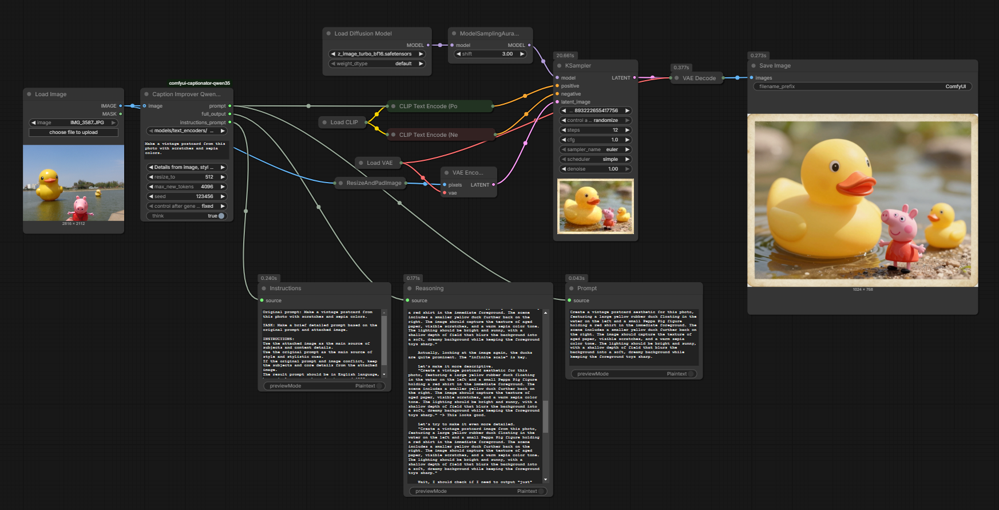

# ComfyUI Captionator Qwen3.5

Simple ComfyUI custom node for running multimodal Qwen3.5 image captioning.

## Node

- Name: `CaptionatorQwen35`
- Description: `ComfyUI Qwen 3.5 Prompting nodes`
- Category: `Captionator`
- Input image: `IMAGE`
- Output caption: `STRING`
- Output full_output: `STRING`

## Features

- Scans `models/text_encoders`, `models/llm`, and `models/LLM` using `folder_paths`
- Loads local Qwen3.5 checkpoints
- Offers one-click download options for Qwen3.5 2B, 4B, and 9B when no local models are found
- Sends both image and prompt to the model
- Supports `seed`
- Supports `think` mode
- Supports optional resize via `resize_to`
- Supports configurable output length via `max_new_tokens`
- Splits visible caption from full reasoning output when `think` is enabled
- Includes a prompt improver node with optional image input

## Installation

Place this folder into your ComfyUI `custom_nodes` directory.

Install dependencies in the same Python environment used by ComfyUI:

```bash
pip install -r requirements.txt
```

You also need a `transformers` build with Qwen3.5 support, plus the model files themselves.
If you run on CUDA with automatic device mapping, install `accelerate` in the same environment as ComfyUI.

## Model placement

Put your Qwen3.5 model in one of these folders:

- `ComfyUI/models/text_encoders`
- `ComfyUI/models/llm`
- `ComfyUI/models/LLM`

The model directory should include the checkpoint and the usual Hugging Face files such as config, tokenizer, and processor files.

## Inputs

- `image`: input image
- `model`: model selected from discovered `.safetensors` files
- If no matching local model is found, the dropdown shows download actions for Qwen3.5 2B, 4B, and 9B into `models/llm`
- `prompt`: multiline instruction for the model
- `resize_to`: longest image side before inference; `0` disables resizing
- `max_new_tokens`: maximum number of generated output tokens
- `seed`: random seed for reproducible sampling
- `think`: enables thinking mode when supported by the installed processor

## Outputs

- `caption`: final caption text; if `think` is enabled and the model returns `</think>`, everything up to and including that tag is removed
- `full_output`: raw model output without trimming

## Usage Examples

Simple workflow:



Image -> prompt -> image workflow for Z-Image:



## Caption Improver

- Name: `Caption Improver Qwen 3.5`
- Optional input image: `IMAGE`
- Output prompt: `STRING`
- Output full_output: `STRING`
- Output instructions_prompt: `STRING`
- Reuses the same model, prompt, resize, token limit, seed, and think settings
- Includes a mode dropdown to choose whether details/style come mainly from the prompt, the image, or both
- Builds an instruction that improves the original prompt, optionally using the attached image for style/detail guidance
- If both prompt and image are provided, the selected mode controls which source has priority for details and style
- Returns a single-paragraph English prompt and the raw model output

Prompt Improver workflow example:



## Notes

- Restart ComfyUI after changing code or installing dependencies.
- If `think` is not supported by your installed processor version, the node falls back automatically.
- Large images and large token counts can increase VRAM use.
- Model discovery only shows `.safetensors` paths containing `qwen`, `3`, and `5` (case-insensitive).
